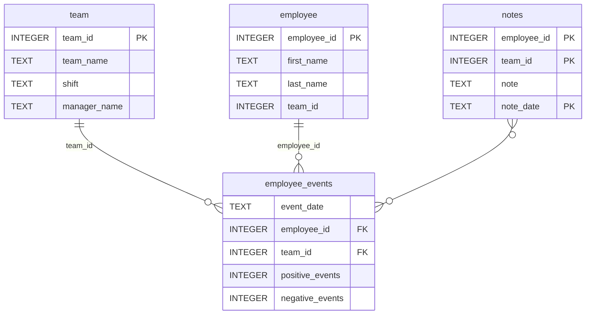

## A Note on Process / AI Use

Throughout this project I used Claude (Anthropic) as a tutor and mentor — not to write code for me, but to guide my thinking, correct mistakes, and push me to reason through decisions. Every line of code was written and understood by me. I believe transparency about AI assistance in the learning process is important, and that knowing how to learn effectively with AI tools is itself a relevant skill for a modern data scientist.

# Employee Performance Dashboard

A data science dashboard for monitoring employee performance and recruitment risk, built as the final project for the Udacity Data Scientist Nanodegree Course 03: Software Engineering for Data Scientists.

## Project Overview

A manufacturing company wants to reduce employee turnover. This project delivers:
- A Python package (`employee_events`) that exposes the company's SQLite database as callable query methods
- A FastHTML dashboard allowing managers to monitor individual employee or team performance trends and predicted recruitment risk
- Automated pytest tests with GitHub Actions CI

## Setup

**Requirements:** Python 3.11+

```bash
# Create and activate virtual environment
python -m venv env
env\Scripts\activate  # Windows
source env/bin/activate  # Mac/Linux

# Install dependencies
pip install -r requirements.txt
pip install -e python-package/

Running the Dashboard
cd report
python dashboard.py
Then open http://127.0.0.1:5001 in your browser.

Running Tests
pytest tests/


## Repository Structure
```
├── README.md
├── assets
│   ├── model.pkl
│   └── report.css
├── env
├── python-package
│   ├── employee_events
│   │   ├── __init__.py
│   │   ├── employee.py
│   │   ├── employee_events.db
│   │   ├── query_base.py
│   │   ├── sql_execution.py
│   │   └── team.py
│   ├── requirements.txt
│   ├── setup.py
├── report
│   ├── base_components
│   │   ├── __init__.py
│   │   ├── base_component.py
│   │   ├── data_table.py
│   │   ├── dropdown.py
│   │   ├── matplotlib_viz.py
│   │   └── radio.py
│   ├── combined_components
│   │   ├── __init__.py
│   │   ├── combined_component.py
│   │   └── form_group.py
│   ├── dashboard.py
│   └── utils.py
├── requirements.txt
├── start
├── tests
    └── test_employee_events.py
```

### employee_events.db


